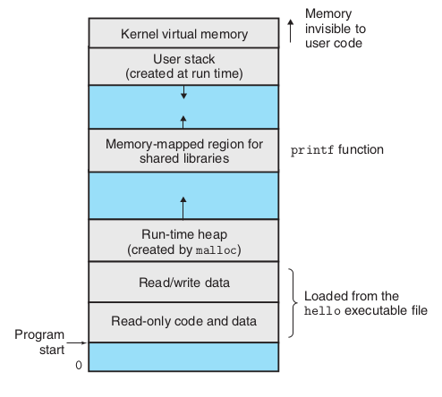

# A Tour of computer systems: notes
Files such as hello.c that consist exclusively
of ASCII characters are known as text files. All other files are known as binary
files.

The representation of hello.c illustrates a fundamental idea: All information
in a system—including disk files, programs stored in memory, user data stored in
memory, and data transferred across a network—is represented as a bunch of bits.
The only thing that distinguishes different data objects is the context in which
we view them. For example, in different contexts, the same sequence of bytes
might represent an integer, floating-point number, character string, or machine
instruction.

The `hello` program begins life as a high-level C program because it can be read
and understood by human beings in that form. However, in order to run hello.c
on the system, the individual C statements must be translated by other programs
into a sequence of low-level machine-language instructions. These instructions are
then packaged in a form called an executable object program and stored as a binary
disk file. Object programs are also referred to as executable object files.

On a Unix system, the translation from source file to object file is performed
by a compiler driver:
```bash
linux> gcc -o hello hello.c
```

Here the `GCC` compiler driver redas the source file `hello.c` and translates it into
an executable object file `hello`. The translation is performed in the squence 
of four phases. The programs that perform the four phases:
1. preprocessor
2. compiler
3. assembler
4. linker
are known collectively as the __compilation system__.

 + _Preprocessing phase_: The preprocessor (`cpp`) modifies the original C program
   according to directives that begin with the `#` character. For eaxmple, the
   `#include <stdio.h>` command in line 1 of `hello.c` tells the preprocessor
   to read the contents of the system header file `stdio.h` and isnert it directly
   into the program text. The result is another C program, typically with the `.i`
   suffix.
   ```
   * hello.c   -> [preprocessor] ->   hello.i
   ```

 + _Compilation phase_: The compiler (`cc1`) translates the   text file `hello.i` into
    the text `hello.s`, which contains an _assembly-language program_. This program includes the following definition
    of function main:
    ```assembly
    main:
        subq    $8, %rsp
        movl    $.LCO, %edi
        call    puts
        movl    $0, %eax
        addq    $8, %rsp
        ret
    ```
    Each of lines 2–7 in this definition describes one low-level machine-
    language instruction in a textual form. Assembly language is useful because
    it provides a common output language for different compilers for different
    high-level languages. For example, C compilers and Fortran compilers both
    generate output files in the same assembly language.
    ```
    hello.i   -> [compiler] ->   hello.s
    ```

 + _Assembly phase_: Next, the assembler (`as`) translates
 the `hello.s` into mchine language instructions,
   packages them in a form known as a _relocable object program_,
   and stores the result int he object file `hello.o`.
   This file is a binary file containin 17 bytes to encode
   the isntructions for function main. If we were to
   view `hello.o` with a text editor, it would
   appear to be gibberish.
   ```
   hello.s   -> [assembler] ->   hello.o
   ```

 + _Linking phase_: Notice that our `hello` program calls
   the `printf` function, which is part of the _standard C library_ provided by every C compiler. The `printf`
   function resides in a separate precompiled object file 
   called `printf.o` which must somehow be merged with
   out `hello.o` program. The linker (`ld`) handles this
   merging. The result is the `hello` file, which is an
   executable object file that is ready to be loaded into 
   memory and executed by the system.
   ```
   printf.o + hello.o   -> [linker] ->   hello
   ```


### Hardwate Organization of a System
+ Buses: Running throughout the system is a collection of electrical conduits called buses
that carry bytes of information back and forth between the components. Buses
are typically designed to transfer fixed-size chunks of bytes known as words. The
number of bytes in a word (the word size) is a fundamental system parameter that
varies across systems. Most machines today have word sizes of either 4 bytes (32
bits) or 8 bytes (64 bits). In this book, we do not assume any fixed definition of
word size. Instead, we will specify what we mean by a “word” in any context that
requires this to be defined.

+ Input/output (I/O) devices are the system’s connection to the external world. Each I/O device is connected to the I/O bus by either a controller or an adapter.
The distinction between the two is mainly one of packaging. Controllers are chip
sets in the device itself or on the system’s main printed circuit board (often called
the motherboard). An adapter is a card that plugs into a slot on the motherboard.
Regardless, the purpose of each is to transfer information back and forth between
the I/O bus and an I/O device.

+ The _main memory_ is a temporary storage device that holds both a program and
the data it manipulates while the processor is executing the program. Physically,
main memory consists of a collection of dynamic random access memory (DRAM)
chips. Logically, memory is organized as a linear array of bytes, each with its own
unique address (array index) starting at zero. In general, each of the machine
instructions that constitute a program can consist of a variable number of bytes.
The sizes of data items that correspond to C program variables vary according
to type. For example, on an x86-64 machine running Linux, data of type short
require 2 bytes, types int and float 4 bytes, and types long and double 8 bytes.

+ The _central processing unit_ (CPU), or simply _processor_, is the engine that
interprets (or _executes_) instructions stored in main memory. At its core
is a word-size storage device (or _register_) called the _program counter_ (PC).
At any point in time, the PC points at (contains the address of) some
machine-language isntruction in main memory. From the time that power is applied
to the system until the time that the
power is shut off, a processor repeatedly executes the instruction pointed at by the
program counter and updates the program counter to point to the next instruction.
A processor _appears_ to operate according to a very simple instruction execution
model, defined by its instruction set architecture. In this model, instructions execute
in strict sequence, and executing a single instruction involves performing
a series of steps. The processor reads the instrcution from memory pointed
at by the program counter (PC), interprets the bits in the instruction, performs
some simple operation dictated by the instruction, and then updates the PC to
point to the next instruction, which may ot may not be contiguous in memory
to the isntruction that was just executed.
There are only a few of these simple operations, and they revolve around
main memory, the register file, and the arithmetic/logic unit (ALU). The register
file is a small storage device that consists of a collection of word-size registers, each
with its own unique name. The ALU computes new data and address values. Here
are some examples of the simple operations that the CPU might carry out at the
request of an instruction:
- _Load_: Copy a byte or a word from main memory into a register,
overwriting the previous contents of the register.
- _Store_: Copy a byte or a word from a register to a location in main memory,
overwritign the previous contents of that location.
- _Operate_: opy the ontents of two resiters to the ALU, perform an
arithmetic operation on thw two words, and store the result in a register,
overwriting the previous contents of that register.
- _Jump_: Extract a wprd from the isntruction itself and copy that word
into the program counter (PC), overwritign the previous value of the PC.

We say that a processor appears to be a simple implementation of its in-
struction set architecture, but in fact modern processors use far more complex
mechanisms to speed up program execution. Thus, we can distinguish the pro-
cessor’s instruction set architecture, describing the effect of each machine-code
instruction, from its microarchitecture, describing how the processor is actually
implemented. 


## The Operating System Manages the Hardware
The operating system has two primary purposes: (1) to protect the hardware
from misuse by runaway applications and (2) to provide applications with simple
and uniform mechanisms for manipulating complicated and often wildly different
low-level hardware devices. The operating system achieves both goals via the
fundamental abstractions: processes, virtual memory, and
files. As this figure suggests, files are abstractions for I/O devices, virtual memory
is an abstraction for both the main memory and disk I/O devices, and processes
are abstractions for the processor, main memory, and I/O devices. We will discuss
each in turn.

### Processes
When a program such as hello runs on a modern system, the operating system
provides the illusion that the program is the only one running on the system. The
program appears to have exclusive use of both the processor, main memory, and
I/O devices. The processor appears to execute the instructions in the program, one
after the other, without interruption. And the code and data of the program appear
to be the only objects in the system’s memory. These illusions are provided by the
notion of a process, one of the most important and successful ideas in computer
science.

A process is the operating system’s abstraction for a running program. Multi-
ple processes can run concurrently on the same system, and each process appears
to have exclusive use of the hardware. By concurrently, we mean that the instruc-
tions of one process are interleaved with the instructions of another process. In
most systems, there are more processes to run than there are CPUs to run them,

Traditional systems could only execute one program at a time, while newer multi-
core processors can execute several programs simultaneously. In either case, a
single CPU can appear to execute multiple processes concurrently by having the
processor switch among them. The operating system performs this interleaving
with a mechanism known as context switching.

### Threads
Although we normally think of a process as having a single control flow, in modern
systems a process can actually consist of multiple execution units, called threads,
each running in the context of the process and sharing the same code and global
data. Threads are an increasingly important programming model because of the
requirement for concurrency in network servers, because it is easier to share data
between multiple threads than between multiple processes, and because threads
are typically more efficient than processes. Multi-threading is also one way to make
programs run faster when multiple processors are available.

### Virtual Memory
Virtual memory is an abstraction that provides each process with the illusion that it
has exclusive use of the main memory. Each process has the same uniform view of
memory, which is known as its _virtual address space_.
In Linux, the topmost region of the address space is reserved for code and data
in the operating system that is common to all processes. The lower region of the
address space holds the code and data defined by the user’s process. Note that
addresses in the figure increase from the bottom to the top.

<p align = "center">

</p>

The virtual address space seen by each process consists of a number of well-
defined areas, each with a specific purpose.
- _Prorgam code and data_: Code begins at the same fixed address for all processes,
followed by data locations that correspond to global C variables. The code nad
data areas are initialized directly from the contents of an executable object file - in our
case, the `hello` executable.
- _Heap_: The code and data areas are followed immediatly by the run-time _heap_.
Unlike the code and data areas, which are fixed in size once the process begins
running, the heap expands and contracts dybamically at tun time as a result of
calls to C standard library routines such as `malloc` and `free`.
- _Shared libraries_: Near the middle of the address space is an area that holds
the code and data for _shared libraries_ such as the C standard library and the math
library. The notion of a shared lbirary is a powerful but somewhat difficult concept.
- _Stack_: At the top of the user's virtual address space is the _user stack_ that
the compiñler uses to implement function calls. Like the ehap, the user ttack expands
and contracts dybamically during the execution of the program. In particular, each tie
we call a function, the stack grows. Each time we return from a function, it contracts.
- _Kernel Virtual Memory_: The rop region of the address space is reserved for the
kernel. Application programs are not allowed to read or write the contents of this area
or to directly call functions in the kernel code Isntead, they must invoke the kernel
to perform these operations.

For virtual memory to work, a sophisticated interaction is required between
the hardware and the operating system software, including a hardware translation
of every address generated by the processor. The basic idea is to store the contents
of a process’s virtual memory on disk and then use the main memory as a cache
for the disk.

### Files
A file is a sequence of bytes, nothing more and nothing less. Every I/O device,
including disks, keyboards, displays, and even networks, is modeled as a file. All
input and output in the system is performed by reading and writing files, using a
small set of system calls known as Unix I/O.
This simple and elegant notion of a file is nonetheless very powerful because
it provides applications with a uniform view of all the varied I/O devices that
might be contained in the system. For example, application programmers who
manipulate the contents of a disk file are blissfully unaware of the specific disk
technology. Further, the same program will run on different systems that use
different disk technologies.


### Systems Communication using Networks
Up to this point in our tour of systems, we have treated a system as an isolated
collection of hardware and software. In practice, modern systems are often linked
to other systems by networks. From the point of view of an individual system, the
network can be viewed as just another I/O device, as shown in Figure 1.14. When
the system copies a sequence of bytes from main memory to the network adapter,
the data flow across the network to another machine, instead of, say, to a local
disk drive. Similarly, the system can read data sent from other machines and copy
these data to its main memory.
With the advent of global networks such as the Internet, copying information
from one machine to another has become one of the most important uses of
computer systems. For example, applications such as email, instant messaging, the
World Wide Web, FTP, and telnet are all based on the ability to copy information
over a network.


## Concurrency and Parallelism
We use the term concurrency to refer to the general concept of a system with
multiple, _simultaneous_ activities, and the term _parallelism_ to refer to the use of
concurrency to make a system run faster. Parallelism can be exploited at multiple
levels of abstraction in a computer system. We highlight three levels here, working
from the highest to the lowest level in the system hierarchy.


### Thread-Level Concurrency
Building on the process abstraction, we are able to devise systems where multiple
programs execute at the same time, leading to concurrency. With threads, we
can even have multiple control flows executing within a single process. Support
for concurrent execution has been found in computer systems since the advent
of time-sharing in the early 1960s. Traditionally, this concurrent execution was
only simulated, by having a single computer rapidly switch among its executing
processes, much as a juggler keeps multiple balls flying through the air. This form
of concurrency allows multiple users to interact with a system at the same time,
such as when many people want to get pages from a single Web server. It also
allows a single user to engage in multiple tasks concurrently, such as having a
Web browser in one window, a word processor in another, and streaming music
playing at the same time. Until recently, most actual computing was done by a
single processor, even if that processor had to switch among multiple tasks. This
configuration is known as a _uniprocessor_ system.
When we construct a system consisting of multiple processors all under the
control of a single operating system kernel, we have a multiprocessor system.
Such systems have been available for large-scale computing since the 1980s, but
they have more recently become commonplace with the advent of _multi-core_
_processors_ and _hyperthreading_.

_Hyperthreading_, sometimes called _simultaneous multi-threading_, is a tech-
nique that allows a single CPU to execute multiple flows of control. It involves
having multiple copies of some of the CPU hardware, such as program counters
and register files, while having only single copies of other parts of the hardware,
such as the units that perform floating-point arithmetic. Whereas a conventional
processor requires around 20,000 clock cycles to shift between different threads,
a hyperthreaded processor decides which of its threads to execute on a cycle-by-
cycle basis. It enables the CPU to take better advantage of its processing resources.

### Instruction-Level Parallelism
At a much lower level of abstraction, modern processors can execute multiple
instructions at one time, a property known as instruction-level parallelism. For
example, early microprocessors, such as the 1978-vintage Intel 8086, required
multiple (typically 3–10) clock cycles to execute a single instruction. More recent
processors can sustain execution rates of 2–4 instructions per clock cycle. Any
given instruction requires much longer from start to finish, perhaps 20 cycles or
more, but the processor uses a number of clever tricks to process as many as 100
instructions at a time.The use of pipelining, where the
actions required to execute an instruction are partitioned into different steps and
the processor hardware is organized as a series of stages, each performing one
of these steps. The stages can operate in parallel, working on different parts of
different instructions. We will see that a fairly simple hardware design can sustain
an execution rate close to 1 instruction per clock cycle.
Processors that can sustain execution rates faster than 1 instruction per cycle
are known as superscalar processors. Most modern processors support superscalar
operation.

### Single-Instruction, Multiple-Data (SIMD) Parallelism
At the lowest level, many modern processors have special hardware that allows
a single instruction to cause multiple operations to be performed in parallel, a
mode known as single-instruction, multiple-data (SIMD) parallelism. For example,
recent generations of Intel and AMD processors have instructions that can add 8
pairs of single-precision floating-point numbers (C data type float) in parallel.
These SIMD instructions are provided mostly to speed up applications that
process image, sound, and video data. Although some compilers attempt to auto-
matically extract SIMD parallelism from C programs, a more reliable method is to
write programs using special vector data types supported in compilers such as `GCC`.

### The Importance of Abstractions in Computer Systems
The use of abstractions is one of the most important concepts in computer science.
For example, one aspect of good programming practice is to formulate a simple
application program interface (API) for a set of functions that allow programmers
to use the code without having to delve into its inner workings. Different programming languages provide different forms and levels of support for abstraction, such
as Java class declarations and C function prototypes.
On the processor side, the instruction set
architecture provides an abstraction of the actual processor hardware. With this
abstraction, a machine-code program behaves as if it were executed on a proces-
sor that performs just one instruction at a time. The underlying hardware is far
more elaborate, executing multiple instructions in parallel, but always in a way
that is consistent with the simple, sequential model. By keeping the same execution model, different processor implementations can execute the same machine
code while offering a range of cost and performance.
On the operating system side, we have introduced three abstractions: files as
an abstraction of I/O devices, virtual memory as an abstraction of program mem-
ory, and processes as an abstraction of a running program. To these abstractions
we add a new one: the virtual machine, providing an abstraction of the entire
computer, including the operating system, the processor, and the programs. The
idea of a virtual machine was introduced by IBM in the 1960s, but it has become
more prominent recently as a way to manage computers that must be able to run
programs designed for multiple operating systems (such as Microsoft Windows,
Mac OS X, and Linux) or different versions of the same operating system.

